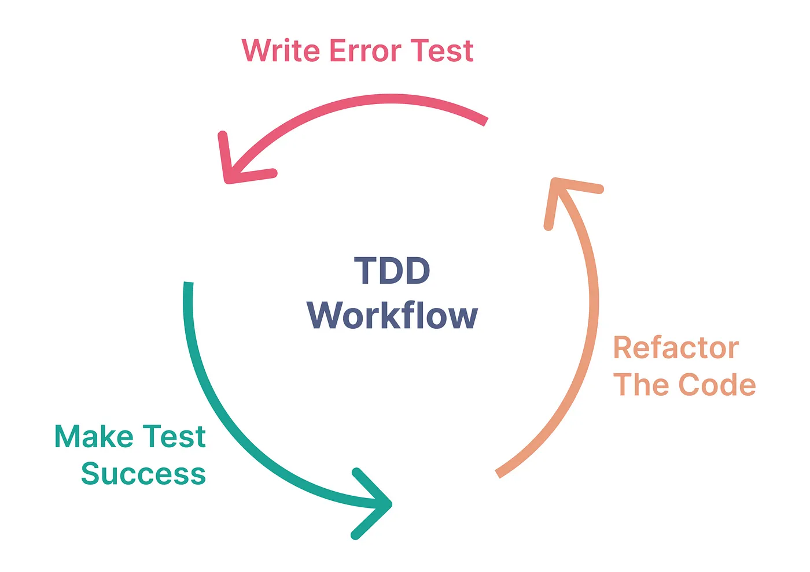

# homebase_flutter_weather_app

A homebase_flutter_weather_app project created in flutter using Riverpod as a main State Management. This project is structured with Clean Architecture with TDD (Test Driven Development)

## Getting Started

The flutter_weather_app is a Flutter application that has 3 main features:

- (1) Search Weather by location name,
- (2) View detail information of the chosen place,
- (3) Store locally the latest weather information result

This project is structured with **Clean Architecture** following **TDD (Test Driven Development)**.

The Clean Architecture will divide each feature has in the Flutter project into 3 main layers:

- Domain Layer
  - The domain layer is the deepest in the clean architecture. This layer contains the code for business logic applications such as entities and use case
- Data Layer
  - The data layer is located at the outermost layer. This layer consists of data source code such as consume Rest API, access to the local database
- Presentation Layer
  - The presentation layer consists of the code to access the data of the app from a repository. Also, there is the code for state management such as providers, BLoC, and so on.


**Test-Driven Development** is an application development process where testing is the main character that drives the development. Testing code



## How to Use

**Step 1:**

Download or clone this repo by using the link below:

```
https://github.com/HadesHo3820/homebase_flutter_weather_app.git
```

**Step 2:**

Go to project root and execute the following command in console to get the required dependencies:

```
flutter pub get
```

**Step 3:**

This project uses `inject` library that works with code generation, execute the following command to generate files:

```
flutter packages pub run build_runner build --delete-conflicting-outputs
```

or watch command in order to keep the source code synced automatically:

```
flutter packages pub run build_runner watch
```

### How to verify Unit Testing

Open the termial in the scope of this project and execute the following command to run all the unit tests have in this project:

```
flutter test
```

## Hide Generated Files

In-order to hide generated files, navigate to `Android Studio` -> `Preferences` -> `Editor` -> `File Types` and paste the below lines under `ignore files and folders` section:

```
*.inject.summary;*.inject.dart;*.g.dart;
```

In Visual Studio Code, navigate to `Preferences` -> `Settings` and search for `Files:Exclude`. Add the following patterns:

```
**/*.inject.summary
**/*.inject.dart
**/*.g.dart
```

### Up-Coming Features:

- Interactive UI Enhancement

### Libraries & Tools Used

- [hooks_riverpod](https://pub.dev/packages/hooks_riverpod) (State Management and implementation of React hooks)
- [dio](https://pub.dev/packages/dio) (A powerful HTTP networking package)
- [get_it](https://pub.dev/packages/get_it) (Service locator)
- [equatable](https://pub.dev/packages/equatable) (Value equality)
- [dartz](https://pub.dev/packages/dartz) (Functional programming implementation)
- [internet_connection_checker](https://pub.dev/packages?q=internet_connection_checker) (pure Dart library that checks for internet)
- [shared_preferences](https://pub.dev/packages/shared_preferences) (key-value local storage)
- [mockito](https://pub.dev/packages/mockito) (A mock framework inspired by Mockito with APIs for Fakes, Mocks, behavior verification, and stubbing)

### Folder Structure

Here is the core folder structure which flutter provides.

```
flutter-app/
|- android
|- build
|- ios
|- lib
|- test
```

Here is the lib folder structure we have been using in this project

```
lib/
|- core/
|   - error/
|   - network/
|   - usecases/
|- constants/
|- features
|   - weather
|     - data
|       - data_sources
|       - models
|       - repositories
|     - domain
|       - entities
|       - repositories
|       - usecases
|     - presentation
|       - pages
|       - providers
|       - widget
|- gen
|- main.dart
```

Here is the test folder structure we have been using in this project

```
|- core
|   - network
|     - network_info_test.dart
|- features
|   - weather
|     - data
|       - data_sources
|       - models
|       - repositories
|     - domain
|       - usecases
|     - presentation
|- fixtures
```

```
test/
|- constants/
|- data/
|- stores/
|- ui/
|- utils/
|- widgets/
|- main.dart
|- routes.dart
```

### Main

This is the starting point of the application. All the application level configurations are defined in this file.

```dart
import 'package:flutter/material.dart';
import 'package:flutter_riverpod/flutter_riverpod.dart';
import 'package:homebase_flutter_weather_app/features/weather/presentation/pages/local_weather_screen.dart';

import 'injection_container.dart' as di;

void main() async {
  WidgetsFlutterBinding.ensureInitialized();
  await di.init();
  runApp(const ProviderScope(child: MyApp()));
}

class MyApp extends StatelessWidget {
  const MyApp({super.key});

  // This widget is the root of your application.
  @override
  Widget build(BuildContext context) {
    return MaterialApp(
      title: 'Flutter Demo',
      theme: ThemeData(
        colorScheme: ColorScheme.fromSeed(seedColor: Colors.deepPurple),
        useMaterial3: true,
      ),
      home: const WeatherScreen(),
    );
  }
}
```
